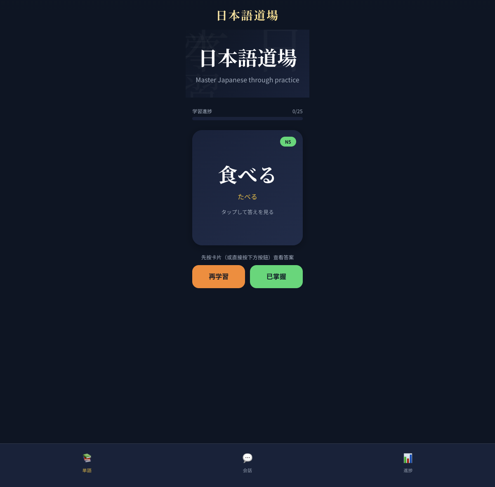
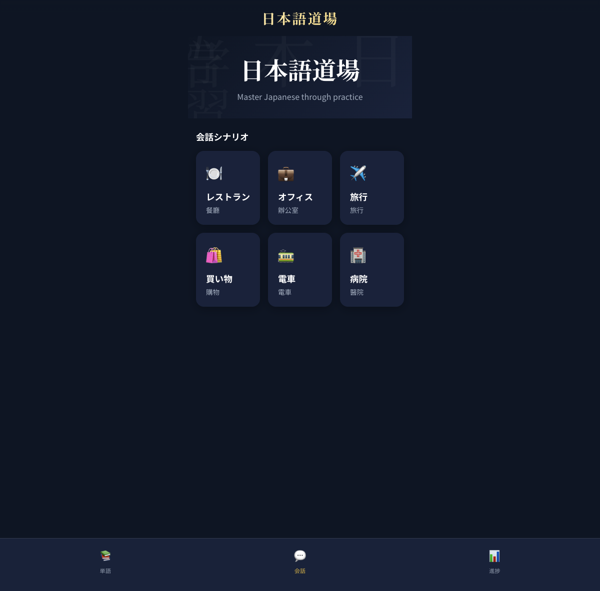
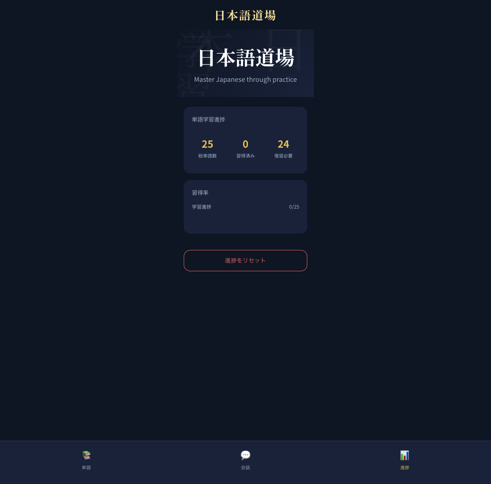

# 日本語道場 (Nihongo Dojo)


一個以 **手機優先（Mobile-first）** 設計的日語學習 Web App，集中在：
- 單字記憶（翻卡 + 間隔複習）
- 情景會話練習（角色對話 + 片語庫）
- 學習進度追蹤（總數 / 已掌握 / 待複習）

## 🌐 線上版本

> GitHub Pages（部署完成後）：
>
> https://jasonckfan.github.io/japanese-study-mobile/

---

## ✨ 主要功能

### 1) 單字訓練（Vocabulary）
- 日文單字 + 振假名（furigana）
- 中文詞義 + 例句
- 翻卡查看答案
- 「再學習 / 已掌握」兩段式操作，降低誤觸
- 以 `localStorage` 儲存學習狀態

### 2) 情景會話（Conversation）
- 6 個常見情景：餐廳、辦公室、旅行、購物、電車、醫院
- 角色對話氣泡
- 片語 bank 快速練習

### 3) 進度統計（Progress）
- 總單字數 / 習得済み / 復習必要
- 習得率視覺化
- 一鍵重置進度

---

## 📱 功能截圖

### 單字訓練


### 會話情景


### 學習進度


---

## 🧰 技術棧

- React 19
- TypeScript
- Vite
- 純 CSS（客製化 Mobile-first 版面）
- localStorage（前端本地資料持久化）

---

## 🚀 本機開發

### 環境需求
- Node.js 18+
- npm

### 安裝依賴
```bash
npm install
```

### 啟動開發模式
```bash
npm run dev
```

### 打包建置
```bash
npm run build
```

### 本機預覽建置結果
```bash
npm run preview
```

---

## 📦 專案結構

```text
src/
├── components/      # React 元件
├── data/            # 單字與情景資料
├── hooks/           # 自訂 hooks（useVocab 等）
├── styles/          # 全域與頁面樣式
├── types/           # TypeScript 型別
└── App.tsx          # 主入口頁

.github/workflows/
└── deploy-pages.yml # GitHub Pages 自動部署

docs/screenshots/
└── *.png            # README 截圖資產
```

---

## 🤖 GitHub Pages 自動部署

此專案已設定 GitHub Actions 自動部署：

- 觸發條件：`push` 到 `main`
- 流程：Install → Build → Upload Artifact → Deploy to Pages
- 部署目標：GitHub Pages

若要手動觸發，可到 Actions 執行 `Deploy Vite site to GitHub Pages` workflow。

---

## 🗺️ 後續可擴充

- 使用者自訂單字集（匯入 CSV / JSON）
- 真實 SRS 演算法（SM-2 等）
- PWA 離線學習能力
- 單字發音（TTS）

---

## License

MIT
